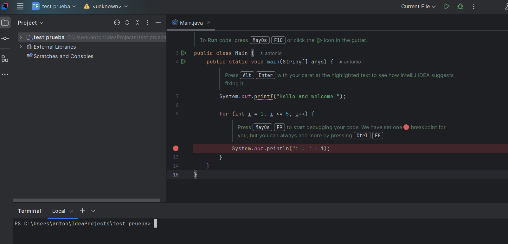
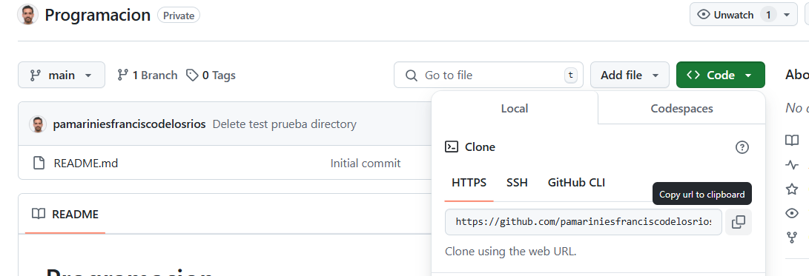
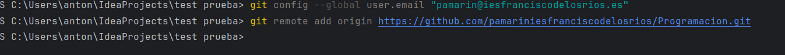
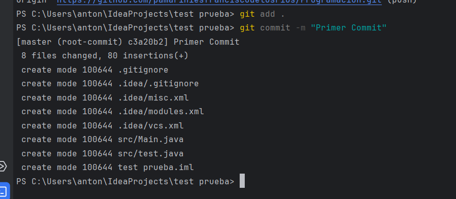
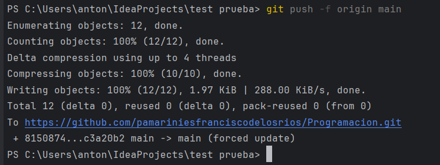
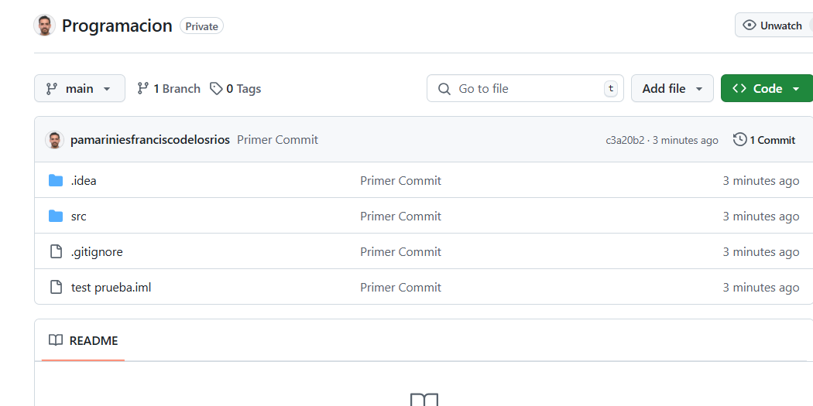

# Configurar **Git en un directorio específico** desde la línea de comandos

Puedes hacerlo desde el CMD de Windows, o en la Terminal de IntelliJ

Vamos a probar primero con un proyecto vacío que se llame Test Prueba



---

### 🛠 **1. Acceder al directorio del proyecto**

Abre el **CMD** y navega hasta la carpeta donde quieres inicializar Git:

```bash
cd ruta\de\tu\proyecto
```

Ejemplo:

```bash
cd C:\Users\TuUsuario\Documents\MiProyecto
```

---

### 🛠 **2. Inicializar un repositorio Git**

Ejecuta el siguiente comando para inicializar Git en el directorio:

```bash
git init
```

Este comando crea una carpeta oculta llamada `.git`, que almacena la configuración y el historial del repositorio.

---

### 🛠 **3. Configurar el usuario y el correo (Opcional, pero recomendado)**

Si aún no has configurado tu usuario en Git, hazlo con estos comandos:

```bash
git config --global user.name "Tu Nombre"
git config --global user.email "tuemail@example.com"
```

Si solo quieres configurarlo para este repositorio (sin afectar otros proyectos), usa `--local` en lugar de `--global`:

```bash
git config --local user.name "Tu Nombre"
git config --local user.email "tuemail@example.com"
```

---

### 🛠 **4. Conectar el repositorio con un remoto (GitHub, GitLab, etc.)**

Si quieres enlazar tu proyecto con un repositorio remoto, copia la ruta de tu repositorio y después el siguiente comando:



```bash
git remote add origin https://github.com/tuusuario/tu-repositorio.git
```




Verifica que se haya agregado correctamente con:

```bash
git remote -v
```

---

### 🛠 **5. Añadir archivos y hacer un commit inicial**

```bash
git add .
git commit -m "Primer commit"
```



---

### 🛠 **6. Enviar los cambios al repositorio remoto**

Si es la primera vez que subes el código, usa:

```bash
git branch -M main
git push -u origin main
```



---

✅ **Ahora tu carpeta está configurada con Git** y vinculada a un repositorio remoto (si agregaste uno).

Podrás ver los cambios GIT en tu repositorio de GitHub


