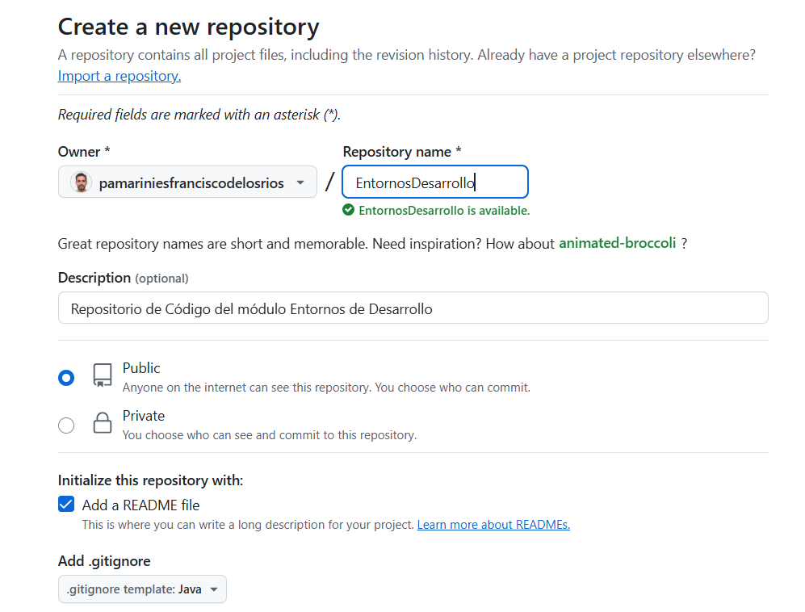
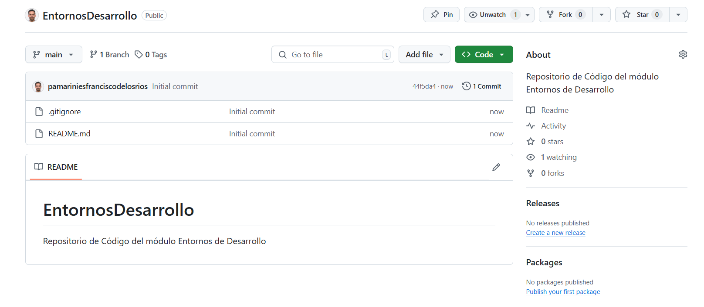
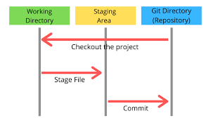
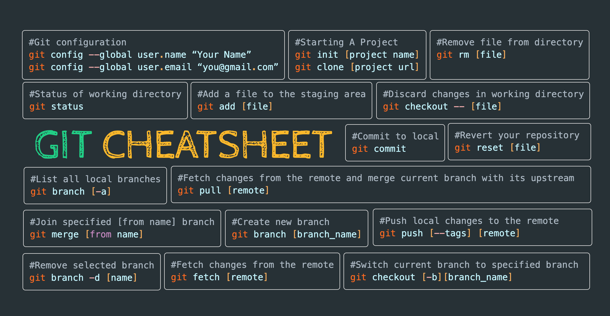

# Control de versiones con Git Hub

Repositorio de Código del módulo Entornos de Desarrollo

Clase del miércoles 12/2/25

### Objetivos

| RA4 | Optimiza código empleando las herramientas disponibles en el entorno de desarrollo. Criterios de evaluación: |
| --- | -------------------------------------------------------------------------------------------------------------- |
| F   | Se ha realizado el control de versiones integrado en el entorno de desarrollo.                                 |
| G   | Se ha documentado el código fuente mediante comentarios.  --> y READMEs                                      |

- Instalación GitHub
- Preparación del Entorno
- Comprobación de la versión de GitHub instalada.
- Creación de un repositorio "Entornos de Desarrollo"

## Introducción

**¿Por qué es importante el control de versiones con GitHub para programadores?**

El **control de versiones** es una práctica fundamental en el desarrollo de software que permite gestionar los cambios en el código de un proyecto a lo largo del tiempo. Con herramientas como **Git** y plataformas como  **GitHub** , los programadores pueden trabajar de manera más organizada, colaborativa y segura.

### **¿Qué es el control de versiones?**

El control de versiones es un sistema que **registra los cambios** realizados en un archivo o conjunto de archivos, permitiendo recuperar versiones anteriores, comparar modificaciones y colaborar en equipo sin riesgo de perder avances.

### **Ventajas de usar GitHub en el desarrollo de software**

**Historial de cambios** : Permite volver a versiones anteriores del código en caso de errores.

**Colaboración en equipo** : Varios programadores pueden trabajar en un mismo proyecto sin sobrescribir el trabajo de otros.

**Seguridad y respaldo** : El código queda almacenado en la nube y puede ser recuperado en cualquier momento.

**Gestión de ramas (branches)** : Facilita la implementación de nuevas funciones sin afectar el código principal hasta que estén listas.

**Integración con otras herramientas** : Compatible con entornos de CI/CD, seguimiento de errores y automatización.

**GitHub** es una herramienta esencial para cualquier programador, ya que optimiza la gestión del código, mejora la productividad y facilita el trabajo en equipo.

## Descarga el programa Git en Windows y otros S.O.

## Cuenta GitHub, Repositorios y Ajustes

## Creación de un repositorio "Entornos de Desarrollo"

Desde nuestra cuenta, lo primero que haremos es dejar preparado un **repositorio**.

1. Pulsamos en crear repositorio
2. Añadimos el nombre del repositorio y la siguiente configuración
3. No es necesario incluir licencias
4. Cuando se cree, nos fijamos en lo que GitHub nos indica para configurar el repositorio en nuestro equipo



### Nos fijamos en lo que GitHub nos indica para configurar el repositorio en nuestro equipo

### Versión inicial de nuestro repositorio



Si te fijas, podrás ver el Readme.md, los branch, los tags, los últimos commit, la rama main ...

Ademas el contenido del documento README.md principal, se verá cargado en la pantalla del repositorio.

## Clonamos el nuevo repositorio en nuestro equipo

### Configuramos Usuario en nuestro equipo

Configurar usuario en **IntelliJ** o en el **Terminal**

### Git Clone

Si todo está configurado, podremos realizar un gitClone del nuevo repositorio

**git clone** https://github.com/TUNOMBREDEUSUARIO/EntornosDesarrollo.git

### Modificación de archivos. **Uso de `git add`, `git commit` y `git push origin main`**

Cuando trabajamos con  **Git** , seguimos un flujo de trabajo en el que agregamos cambios al control de versiones, los guardamos con un mensaje descriptivo y luego los subimos a un repositorio remoto como GitHub.



#### **Pasos para realizar `git add`, `git commit` y `git push origin main`**

**Inicializar el repositorio** *(si aún no lo has hecho)*

```bash
git init
```

**Añadir los archivos al área de preparación**

```bash
git add .
```

🔹 Esto agrega **todos los archivos** modificados al área de "staging" (preparación).

🔹 Si solo quieres agregar un archivo específico:

```bash
git add nombre_archivo.ext
```

**Confirmar los cambios con un mensaje descriptivo**

```bash
git commit -m "Descripción breve de los cambios"
```

🔹 Esto guarda los cambios en el historial del repositorio.

**Subir los cambios al repositorio remoto en la rama `main`**

```bash
git push origin main
```

🔹 Esto envía los cambios a GitHub en la rama principal del proyecto.

🔹 Si es la primera vez que subes la rama, usa:

```bash
git push -u origin main
```

**Con esto, tus cambios estarán guardados en GitHub y accesibles desde cualquier lugar.**

## Configuración en Terminal y en IDE IntelliJ

## Referencias

* [CHeet sheet](https://education.github.com/git-cheat-sheet-education.pdf)
* [Training Github](https://training.github.com/downloads/es_ES/github-git-cheat-sheet.pdf)
* [SantiMacNet](https://santimacnet.wordpress.com/2018/01/05/git-trabajando-con-git-dia-a-dia-visual-studio/)
* [elhackernet](https://x.com/elhackernet/status/1479209409465229313)
* [TicArte Rafa Morales](https://www.ticarte.com/contenido/control-de-versiones-con-git)



## VideoTutorial Brais Moure

[Enlace a videotutorial](https://www.youtube.com/embed/3GymExBkKjE)

[https://www.youtube.com/embed/3GymExBkKjE](https://www.youtube.com/embed/3GymExBkKjE)
