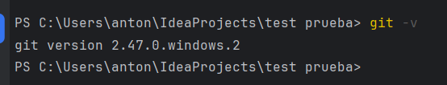
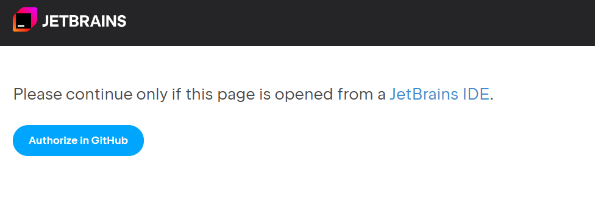
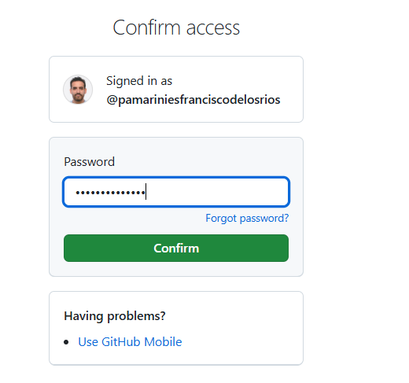
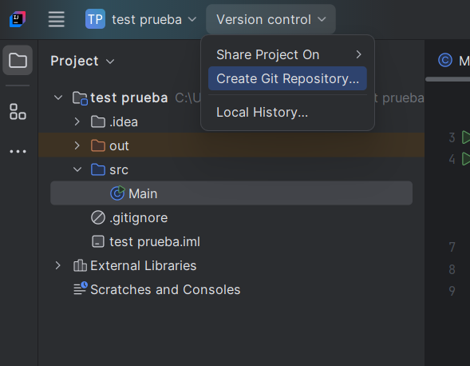
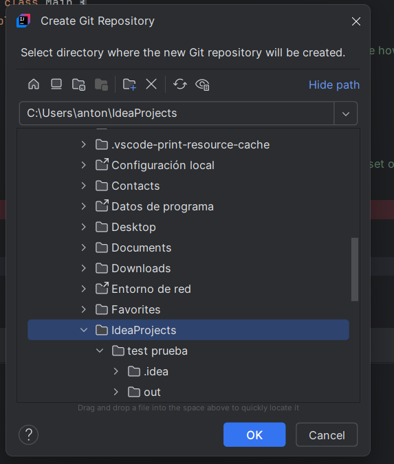
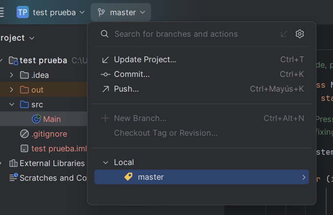
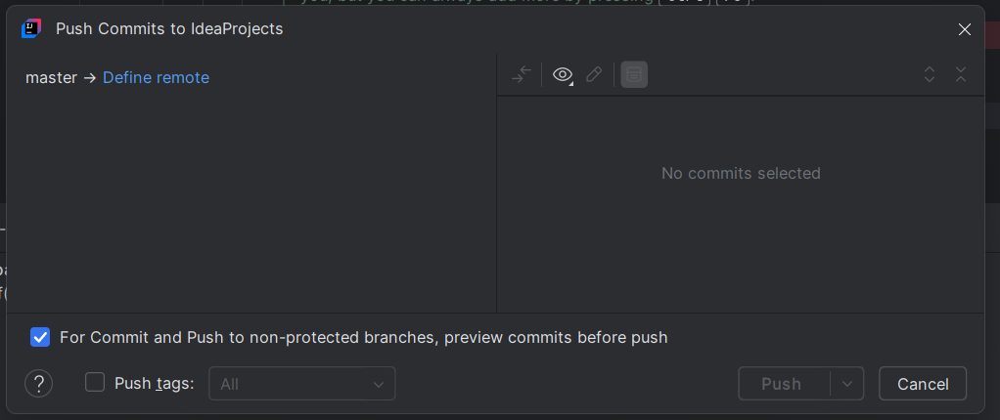
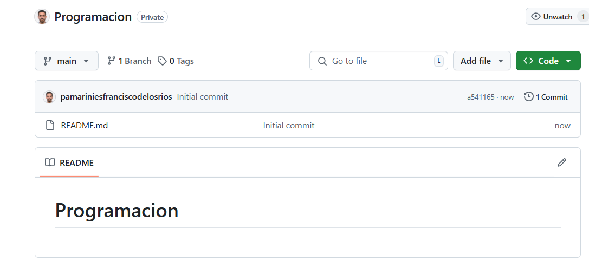

# Configuración en IntelliJ

1. **Instalar Git (si no está instalado)**

* Descarga e instala Git desde [git-scm.com](https://git-scm.com/).
* Asegúrate de que Git está disponible en la terminal ejecutando:
  ```sh
  git --version
  ```




### 2. **Configurar Git en IntelliJ IDEA**

* Abre IntelliJ IDEA.
* Ve a  **File > Settings > Version Control > Git** .
* En el campo "Path to Git executable", asegúrate de que el camino a `git.exe` (Windows) o `git` (Linux/Mac) está correcto.
* Haz clic en **Test** para verificar la configuración.


### 3. **Conectar IntelliJ con GitHub**

* Ve a  **File > Settings > Version Control > GitHub** .
* Haz clic en  **Add account** .
* Selecciona **Log in via GitHub** y sigue las instrucciones para autorizar IntelliJ.
  * AÑADE la opción de **clonar mediantes ssh**


Autoriza la conexión:



---


---


Para confirmar, mejor usar contraseña que móvil:



---


#### En IntelliJ, te verás logueado:


* Alternativamente, puedes usar un  **token de acceso personal** :
  * Ve a [GitHub Tokens](https://github.com/settings/tokens).
  * Genera un nuevo token con permisos para repositorios (`repo`).
  * Copia el token y pégalo en IntelliJ.

### 4. **Clonar un repositorio desde GitHub**

* Ve a  **File > New > Project from Version Control > Git** .
* Introduce la URL del repositorio.
* Selecciona el directorio donde se clonará.
* Haz clic en  **Clone** .

> Esta opción, de primeras, es la más fácil.


Una vez creado el repositorio Entornos, creamos el repositorio Programación, que será privado.


### 5. **Inicializar un nuevo repositorio y subirlo a GitHub**

* Abre un proyecto en IntelliJ.
* Ve a  **VCS > Enable Version Control Integration** , selecciona **Git** y haz clic en  **OK** .
* Ve a **Git > Commit** para confirmar los archivos que quieres incluir.
* Haz clic en  **Commit** .
* Luego, ve a  **Git > Push** , elige el repositorio remoto y haz clic en  **Push** .




---



---

Rama master



---

Hacer el commit y el push


---


---



#### Creamos el repositorio Programacion

Lo hacemos privado



Cogemos la nueva ruta


https://github.com/tuusuarioGit/Programacion.git


Y autorizamos a Git


#### Definimos la ruta Remota

`https://github.com/tuUsuario/Programacion.git`


Y autorizamos para que nos permita hacer el push


Y, si hemos hecho bien el Git Push, nos debe aparecer en el repositorio de github


### 6. **Configurar el repositorio remoto manualmente**

* Abre la terminal de IntelliJ.
* Ejecuta:
  ```sh
  git remote add origin https://github.com/tu-usuario/tu-repositorio.git
  git branch -M main
  git push -u origin main
  ```

### 7. **Trabajar con Git en IntelliJ**

* Usa el panel de **Git** en la parte inferior para realizar commits, pulls y pushes.
* Para crear nuevas ramas, ve a  **Git > Branches** .
* Para fusionar cambios, usa **Git > Merge** o  **Rebase** .
