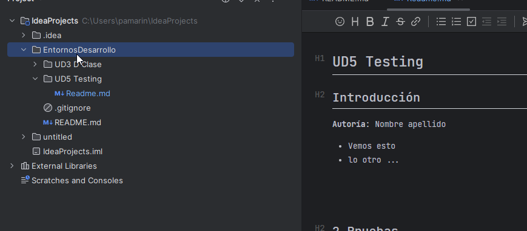

# UD5 Testing

## Introducción

**Autoría**: Nombre apellido

* Vemos esto
* lo otro ...

[Estamos viendo el primer punto](https://https://pamariniesfranciscodelosrios.github.io/EDpublic/UD5%20Testing/1%20Testing/1%20Testing/)

[Enlace](https://pamariniesfranciscodelosrios.github.io/EDpublic/UD5%20Testing/1%20Testing/1%20Testing/)

[Enlace](https://pamariniesfranciscodelosrios.github.io/EDpublic/UD5%20Testing/1%20Testing/1%20Testing/)

* [ ]  Task list 1
* [ ]  Task list
* [ ]

## 2 Pruebas

## 3 Debug

## Framework

CI/CD
Calidad
Referencias
