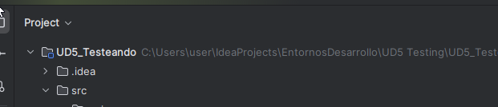

Probando Test:

Si ya tenemos el repositorio creado tenemos que:
------------------------------------------------

1. Crear un nuevo Proyecto en Intellij,
2. Seleccionar la carpeta del repositorio GitHub (UD5)
3. Crear allí las clases y los test

[Enlace para ver Jacobo y dependencias:](https://github.com/UnProgramadorNaceOfficial/java-test-unitarios)

[Code Coverage](https://www.jetbrains.com/help/idea/code-coverage.html)

[TDD en documentación IntelliJ](https://www.jetbrains.com/help/idea/tdd-with-intellij-idea.html#iterate)
