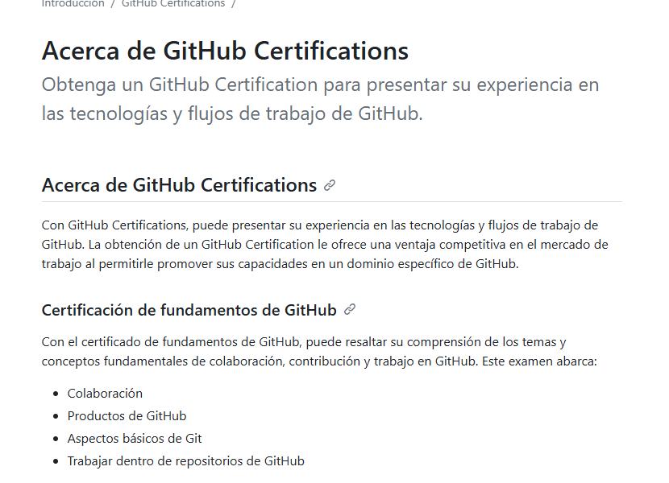

## Control de versiones con Git Hub

Clase del viernes 14/2/25 con la colaboración del alumnado de **2º DAM** IES Francisco de los Ríos

## 14 Febrero 2025. Actividades propuestas

Vamos a probar el control de versiones con ejemplos breves de código Java

### Actividad 1:

`Alumno: Nombre Apellido`: Juan Jesus Lopez Solano, Maria Pastrana Moreno

Arrancamos GitHub, nos conectamos a nuestra cuenta y creamos un repositorio, no hace falta comando se hace mediante la interfaz de GitHub

### Actividad 2:

` `Alumno: Rafa y Juan Maria `

Inicializar la conexión con el repositorio, explicar los primeros comandos que salen al crear el repositorio

* echo "# E" >> README.md : Este comando agrega la línea "# E" al archivo README.md. Si el archivo no existe, se creará.
* git init : Inicializa un nuevo repositorio Git en el directorio actual.
* git add README.md : Añade el archivo README.md al área de preparación (staging area), preparándolo para el commit.
* git commit -m "first commit" : Realiza un commit con el mensaje "first commit", guardando los cambios en el repositorio local.
* git branch -M main : Crea o renombra la rama actual a "main" y la establece como la rama principal.
* git remote add origin “enlacegithub” : Añade un repositorio remoto con el nombre "origin" y la URL especificada ("enlacegithub").
* git push -u origin main : Sube los cambios al repositorio remoto en la rama "main" y establece una referencia de seguimiento entre la rama local y la remota.

### Actividad 3:

`Juan y Maria` : `

Añadir colaboradores al repositorio mandando invitaciones y aceptandolas por gmail. 

Todo por interfaz sin comandos

### Actividad 4:

``Alumno: Jose Angel :`

 Realizacion del clone de un repositorio con el comando

**git clone “url”** . y explicacion del **git Fork**

### Actividad 5:

`Alumno: Juan Jesus Capitan y Fernando Ramas:`

Explicación de **gitnore** y datos a introducir en el mismo para que los usuarios no tengan conflictos

### Actividad 6:

` ``Alumno: Cristian y Antonio Guerola:  `

Explicacion de las ramas y usar el comando `git checkout -b “nombrerama”`

### Actividad 7:

```
Alumno: Santiago Garcia Ruiz y Francisco Pérez Ruiz
```

Realización del Add (‘git add .’),  explicación de la realización de un Commit 

`(git commit -m "mensaje"),` Como guardar cambios en el historial del repositorio. 

`Realización del Push (git push origin” rama” `) `una vez creada la rama y envíar los cambios a GitHub.


### Actividad 8:

```
Alumno:  Alfonso Jaén Tejederas y Álvaro Fernández Sánchez`
```

Dentro de github hacer un merge y terminar haciendo un pull en el proyecto de otra persona para que tenga los datos que haya subido la persona que haya realizado el push y merge.

### Actividad 9:

```
Alumno: JuanSerrano y Francisco Marin:
```

Realizacion de los pulls a InteliJ mediante git pull `

### Actividad 10:

```
Alumno: Alberto Romero Pino
```

Explicación:

No debes tocar el repositorio de un compañero directamente porque puede generar conflictos entre cambios, dificultar el seguimiento del trabajo y perder control sobre el código. La mejor práctica es usar ramas separadas y hacer "pull requests" para revisar y fusionar los cambios de manera organizada y sin interferencias.

---

**Buen trabajo, muchas gracias a todos por la participación!!**


---

## [Certificaciones Git en Español](https://docs.github.com/es/get-started/showcase-your-expertise-with-github-certifications/about-github-certifications)




---


**

## Objetivos

### **1. Repositorios (Repositories)**

Espacios donde se almacena el código de un proyecto, incluyendo su historial de versiones y archivos relacionados.

### **2. Clonar (Clone) y Fork**

* **Clonar (`git clone <URL>`)** : Copia un repositorio en tu computadora para trabajar en él localmente.
* **Fork** : Crea una copia de un repositorio en tu cuenta para modificarlo sin afectar el original.

### **3. Ramas (Branches)**

Permiten trabajar en nuevas características sin afectar la versión principal del código.

Comandos básicos:

```bash
git branch nueva-rama  # Crear una nueva rama
git checkout nueva-rama  # Cambiar de rama
git merge nueva-rama  # Unir los cambios a otra rama
```

### **4. Commits y Push**

* **Commit (`git commit -m "mensaje"`)** : Guarda cambios en el historial del repositorio.
* **Push (`git push origin rama`)** : Envía los cambios a GitHub.

### **5. Pull Request (PR)**

Solicitud para que los cambios de una rama sean revisados y fusionados en otra. Fundamental en trabajo colaborativo.
